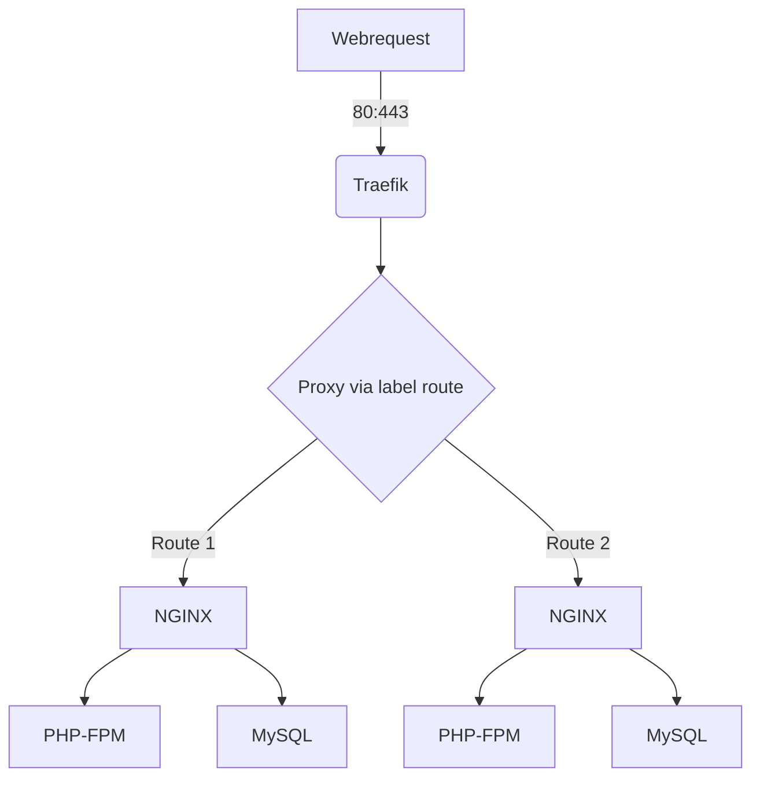

# Project to deploy a fully working local environment 

## Diagram:



## Table of content:
[[_TOC_]]


## Tech included:
* traefik proxy
* NGINX 
* PHP-FPM
* MySQL

## changes regarding usage from plain docker:
* Containers are interconnected within a own network [ NGINX - MySQL - PHPFPM]
* Traefik is exposed to 80:443 and proxys to the containers dynamically 
* Dynamic proxy is used with labels ( see docker-compose.yaml )
* Traefik can deploy SSL certificates from lets encrypt from Production / Staging


## Requirements:
* Windows 10 / 11  + Linux Subsystem for Windows V2
* Docker Engine (Windows + MacOS)
* docker-compose / docker installed in WSL
* docker compose via Homebrew (macOS)
* installed Ansible to prepare local environment (ansible/yaml playbooks)

* Settings in Docker Desktop (Windows)
https://docs.docker.com/desktop/windows/wsl/

* MacOS Brew Install Script for Docker-Compose
brew install docker docker-compose


### Usage

Install ansible on an Ubuntu / Debian based plattform:
```
chmod +x ansible/install-ansible.sh
./ansible/install-ansible.sh
```

Get Composer if needed:
```
ansible-playbook ansible/install-composer.yaml -v,
```


Update your SSH Conf if needed with:
```
ansible-playbook ansible/update-ssh-conf.yaml -v,
Add --check at the end to do a dry run.
```


prepare your local env
```
ansible-playbook ansible/prepare-local-dev.yaml -v --extra-vars "CustomerName=fullmoonOrWhatever prodHostName=lightsail-fullmoon",
```
If used correctly it will copy over SQL and Media files.


* Traefik is needed so start it first.
```
cd traefik
docker-compose up -d
```

Start your Docker Environment:
```
docker-compose up -d 
```

See the environment file for additional settings.


### Extended Configuration
* Labels
```
 - "traefik.enable=true"
Enables discovery for container from traefik without restart of the container

 - "traefik.http.routers.fmtv.rule=Host(`${CUSTOMERNAME}.localdev.pxia.de`)"
Will use Hostname rule to route to the container 

 - "traefik.docker.network=traefik-network"
Designate the network from the traefik container

 - "traefik.http.routers.fmtv.entrypoints=web" 
Entrypoint for HTTP

 - "traefik.http.routers.whoami.entrypoints=websecure"
Entrypoint for HTTPS

 - "traefik.http.routers.whoami.tls.certresolver=myresolver"
Resolver for LE Certificates
```

### Run docker remotly
* SSH User with sudo or atleast access to the docker.sock is needed.
** all FMD Users have sudo privileges.


```
* Create a named context with remote host via ssh:
docker context create dockerhost1 --docker "host=ssh://ubuntu@18.197.17.149"
```


```
* Select created context to use for all docker commands on the CLI
docker context use dockerhost1
```

* see current configuration:
```

$ docker context ls
---------------------------------------------------------------------------------------------------------------------------
NAME            DESCRIPTION                               DOCKER ENDPOINT               KUBERNETES ENDPOINT   ORCHESTRATOR
default         Current DOCKER_HOST based configuration   unix:///var/run/docker.sock                         swarm
dockerhost1 *                                             ssh://ubuntu@18.197.17.149                          
---------------------------------------------------------------------------------------------------------------------------
```


# Open To Do List:

- [x] Base Docker Images for environment
- [x] Network all the containers!
* fmd-docker-registry (see gitlab)
- [x] Image for Traefic Proxy
- [x] Base Docker Compose
- [x] Auto Export SQL to Dumpstar
* dumpstar.pxia.de
- [x] SQL Dumps Access
- [x] Automatic Copy from Remote to Dumpstar 
- [x] Auto Import SQL at Startup
- [x] Test without Traefik
- [x] Test with Traefik Proxy infrond of NGINX + random ports without Data
- [ ] Test Whole project with customer data
- [ ] Play Star Citizen
